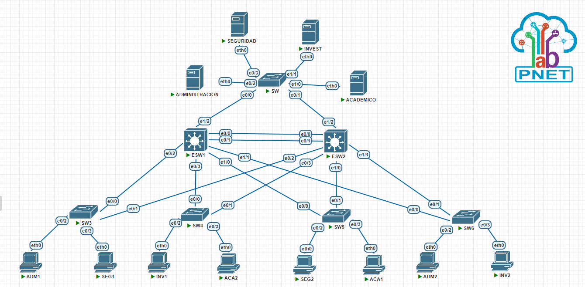
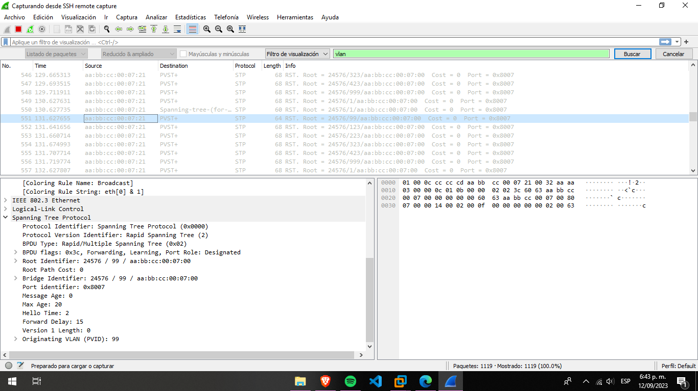
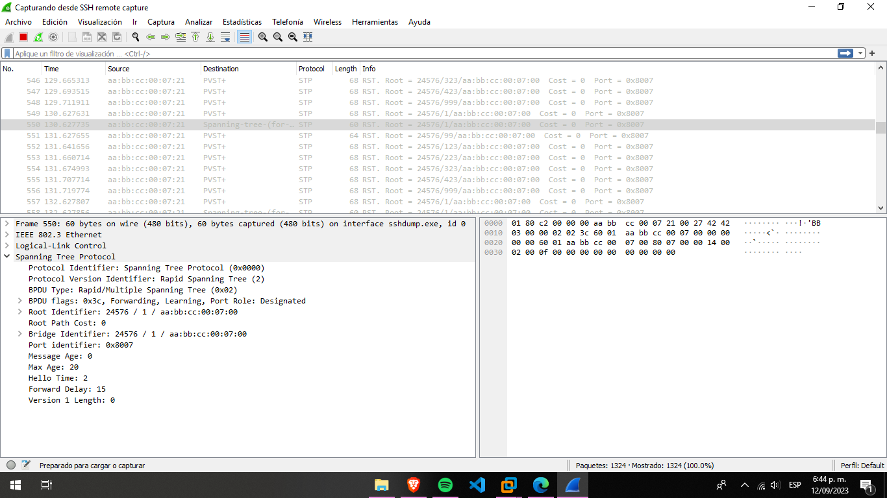

## **¡Manual técnico!**

# Tabla de resumen de todas las direcciones IP utilizadas en la práctica:

<table>
  <thead>
    <tr>
      <th>Dispositivo</th>
      <th>Dirección IP</th>
      <th>Máscara de Subred</th>
      <th>Puerta de Enlace Predeterminada</th>
      <th>VLAN</th>
    </tr>
  </thead>
  <tbody>
    <tr>
      <td>SEGURIDAD</td>
      <td>172.16.27.2</td>
      <td>255.255.255.0</td>
      <td>172.16.27.1</td>
      <td>423</td>
    </tr>
    <tr>
      <td>INVEST</td>
      <td>172.16.26.2</td>
      <td>255.255.255.0</td>
      <td>172.16.26.1</td>
      <td>323</td>
    </tr>
    <tr>
      <td>ADMINISTRACION</td>
      <td>172.16.24.2</td>
      <td>255.255.255.0</td>
      <td>172.16.24.1</td>
      <td>123</td>
    </tr>
    <tr>
      <td>ACADEMICO</td>
      <td>172.16.25.2</td>
      <td>255.255.255.0</td>
      <td>172.16.25.1</td>
      <td>223</td>
    </tr>
    <tr>
      <td>SW</td>
      <td>No aplica</td>
      <td>No aplica</td>
      <td>No aplica</td>
      <td>VLAN</td>
    </tr>
    <tr>
      <td>ESW1</td>
      <td>No aplica</td>
      <td>No aplica</td>
      <td>No aplica</td>
      <td>VLAN</td>
    </tr>
    <tr>
      <td>ESW2</td>
      <td>No aplica</td>
      <td>No aplica</td>
      <td>No aplica</td>
      <td>VLAN</td>
    </tr>
    <tr>
      <td>SW3</td>
      <td>No aplica</td>
      <td>No aplica</td>
      <td>No aplica</td>
      <td>VLAN</td>
    </tr>
    <tr>
      <td>SW4</td>
      <td>No aplica</td>
      <td>No aplica</td>
      <td>No aplica</td>
      <td>VLAN</td>
    </tr>
    <tr>
      <td>SW5</td>
      <td>No aplica</td>
      <td>No aplica</td>
      <td>No aplica</td>
      <td>VLAN</td>
    </tr>
    <tr>
      <td>SW6</td>
      <td>No aplica</td>
      <td>No aplica</td>
      <td>No aplica</td>
      <td>VLAN</td>
    </tr>
    <tr>
      <td>ADM1</td>
      <td>172.16.24.3</td>
      <td>255.255.255.0</td>
      <td>172.16.24.1</td>
      <td>123</td>
    </tr>
    <tr>
      <td>SEG1</td>
      <td>172.16.27.3</td>
      <td>255.255.255.0</td>
      <td>172.16.27.1</td>
      <td>423</td>
    </tr>
    <tr>
      <td>INV1</td>
      <td>172.16.26.3</td>
      <td>255.255.255.0</td>
      <td>172.16.26.1</td>
      <td>323</td>
    </tr>
    <tr>
      <td>ACA2</td>
      <td>172.16.25.4</td>
      <td>255.255.255.0</td>
      <td>172.16.25.1</td>
      <td>223</td>
    </tr>
    <tr>
      <td>SEG2</td>
      <td>172.16.27.4</td>
      <td>255.255.255.0</td>
      <td>172.16.27.1</td>
      <td>423</td>
    </tr>
    <tr>
      <td>ACA1</td>
      <td>172.16.25.3</td>
      <td>255.255.255.0</td>
      <td>172.16.25.1</td>
      <td>223</td>
    </tr>
    <tr>
      <td>ADM2</td>
      <td>172.16.24.4</td>
      <td>255.255.255.0</td>
      <td>172.16.24.1</td>
      <td>123</td>
    </tr>
    <tr>
      <td>INV2</td>
      <td>172.16.26.4</td>
      <td>255.255.255.0</td>
      <td>172.16.26.1</td>
      <td>323</td>
    </tr>
  </tbody>
</table>

# Captura de la implementación de la topología.

# Detalle de los comandos usados para ESW1, SW5 y SW.

## ESW1:
- `enable`: Ingresa al modo de configuración privilegiada.
- `configure terminal`: Ingresa al modo de configuración global.
- `vlan 123`: Crea la VLAN 123.
- `name Administracion`: Asigna el nombre "Administración" a la VLAN 123.
- `vlan 223`: Crea la VLAN 223.
- `name Academico`: Asigna el nombre "Académico" a la VLAN 223.
- `vlan 323`: Crea la VLAN 323.
- `name Investigaciones`: Asigna el nombre "Investigaciones" a la VLAN 323.
- `vlan 423`: Crea la VLAN 423.
- `name Seguridad`: Asigna el nombre "Seguridad" a la VLAN 423.
- `vlan 99`: Crea la VLAN 99.
- `name Nativa`: Asigna el nombre "Nativa" a la VLAN 99.
- `vlan 999`: Crea la VLAN 999.
- `name Blackhole`: Asigna el nombre "Blackhole" a la VLAN 999.
- `vtp version 2`: Configura el protocolo VTP para usar la versión 2.
- `vtp mode server`: Configura el modo del dispositivo como servidor VTP.
- `vtp domain pareja23`: Establece el dominio VTP como "pareja23".
- `vtp password usac`: Establece la contraseña VTP como "usac".
- `interface range e0/0-3`: Entra en la configuración de un rango de interfaces desde Ethernet 0/0 hasta 0/3.
- `switchport trunk encapsulate dot1q`: Configura la encapsulación de troncal como dot1q.
- `switchport mode trunk`: Configura la interfaz como troncal (trunk).
- `switchport trunk vlan 99`: Establece la VLAN 99 como la VLAN nativa en las interfaces de troncal.
- `interface range e1/0-2`: Entra en la configuración de un rango de interfaces desde Ethernet 1/0 hasta 1/2.
- `spanning-tree mode rapid-pvst`: Configura el protocolo STP (Spanning Tree Protocol) en modo Rapid-PVST.
- `spanning-tree vlan 1,123,223,323,423,99,999`: Especifica las VLANs en las que se debe ejecutar STP.
- `spanning-tree vlan 1,123,223,323,423,99,999 root primary`: Configura este switch como el puente raíz para las VLAN especificadas.
- `do write`: Guarda la configuración en la memoria del dispositivo.
 

## SW5:
- `vtp version 2`: Configura el protocolo VTP para usar la versión 2.
- `vtp mode client`: Configura el modo del dispositivo como cliente VTP.
- `vtp domain pareja23`: Se une al dominio VTP "pareja23".
- `vtp password usac`: Establece la contraseña VTP como "usac".
- `interface range e0/0-1`: Entra en la configuración de un rango de interfaces desde Ethernet 0/0 hasta 0/1.
- `switchport trunk encapsulate dot1q`: Configura la encapsulación de troncal como dot1q.
- `switchport mode trunk`: Configura la interfaz como troncal (trunk).
- `switchport trunk vlan 99`: Establece la VLAN 99 como la VLAN nativa en las interfaces de troncal.
- `interface e0/2`: Entra en la configuración de la interfaz Ethernet 0/2.
- `switchport mode access`: Configura la interfaz como modo de acceso.
- `switchport access vlan 423`: Asigna la VLAN 423 a la interfaz.
- `spanning-tree mode rapid-pvst`: Configura el protocolo STP en modo Rapid-PVST.
- `spanning-tree vlan 1,123,223,323,423,99,999`: Especifica las VLANs en las que se debe ejecutar STP.
 

## SW:
- `vtp version 2`: Configura el protocolo VTP para usar la versión 2.
- `vtp mode client`: Configura el modo del dispositivo como cliente VTP.
- `vtp domain pareja23`: Se une al dominio VTP "pareja23".
- `vtp password usac`: Establece la contraseña VTP como "usac".
- `interface range e0/0-1`: Entra en la configuración de un rango de interfaces desde Ethernet 0/0 hasta 0/1.
- `switchport trunk encapsulate dot1q`: Configura la encapsulación de troncal como dot1q.
- `switchport mode trunk`: Configura la interfaz como troncal (trunk).
- `switchport trunk vlan 99`: Establece la VLAN 99 como la VLAN nativa en las interfaces de troncal.
- `interface e0/2`: Entra en la configuración de la interfaz Ethernet 0/2.
- `switchport mode access`: Configura la interfaz como modo de acceso.
- `switchport access vlan 123`: Asigna la VLAN 123 a la interfaz.
- `interface e0/3`: Entra en la configuración de la interfaz Ethernet 0/3.
- `switchport mode access`: Configura la interfaz como modo de acceso.
- `switchport access vlan 423`: Asigna la VLAN 423 a la interfaz.
- `interface e1/1`: Entra en la configuración de la interfaz Ethernet 1/1.
- `switchport mode access`: Configura la interfaz como modo de acceso.
- `switchport access vlan 323`: Asigna la VLAN 323 a la interfaz.
- `interface e1/0`: Entra en la configuración de la interfaz Ethernet 1/0.
- `switchport mode access`: Configura la interfaz como modo de acceso.
- `switchport access vlan 223`: Asigna la VLAN 223 a la interfaz.
- `interface range e1/2-3`: Entra en la configuración de un rango de interfaces desde Ethernet 1/2 hasta 1/3.
- `switchport mode access`: Configura las interfaces como modo de acceso.
- `switchport access vlan 999`: Asigna la VLAN 999 a las interfaces.
- `spanning-tree mode rapid-pvst`: Configura el protocolo STP en modo Rapid-PVST.
- `spanning-tree vlan 1,123,223,323,423,99,999`: Especifica las VLANs en las que se debe ejecutar STP.
 

# Capturas de Wireshark

## VLAN

 

## STP

