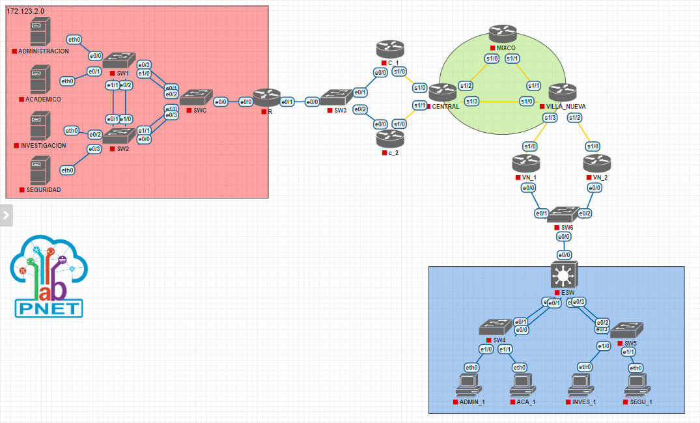
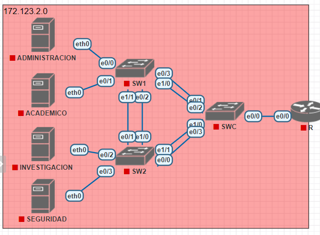
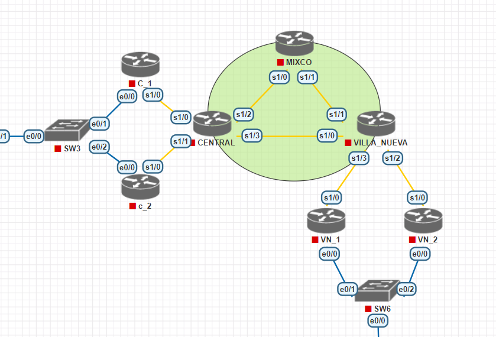
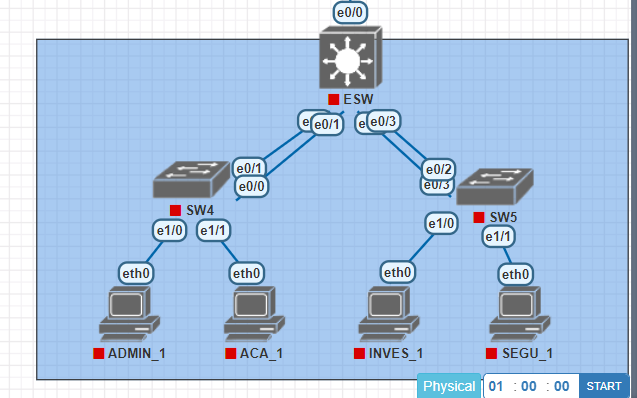

# DIRECCIONES IP
## RED 172.123.2.0 (CEDE CENTRAL)
| IP           | Máscara de subred | Gateway      | Dispositivo    | Int  |
|--------------|-------------------|--------------|----------------|------|
| 172.123.2.2  | 255.255.255.248   | 172.123.2.1  | ACADEMICO      | eth0 |
| 172.123.2.34 | 255.255.255.248   | 172.123.2.33 | INVESTIGACIÓN  | eth0 |
| 172.123.2.50 | 255.255.255.248   | 172.123.2.49 | ADMINISTRACION | eth0 |
| 172.123.2.66 | 255.255.255.248   | 172.123.2.65 | SEGURIDAD      | eth0 |
| 172.123.0.4  | 255.255.255.248   | NA           | R              | e0/1 |
| 172.123.0.2  | 255.255.255.248   | 172.123.0.1  | C_1            | e0/0 |
| 172.123.0.3  | 255.255.255.248   | 172.123.0.1  | C_2            | e0/0 |
| 173.123.0.2  | 255.255.255.248   | 173.123.0.1  | VN_1           | e0/0 |
| 173.123.0.3  | 255.255.255.248   | 173.123.0.1  | VN_2           | e0/0 |
| 173.123.0.4  | 255.255.255.248   | NA           | ESW            | e0/0 |

# REDES UTILIZADAS
| ID de red    | Máscara de subred | Host disponibles | Gateway      |
|--------------|-------------------|------------------|--------------|
| 172.123.2.0  | 255.255.255.0     | 256              | NA           |
| 172.123.2.0  | 255.255.255.224   | 30               | 172.123.2.1  |
| 172.123.2.32 | 255.255.255.240   | 14               | 172.123.2.33 |
| 172.123.2.48 | 255.255.255.240   | 14               | 172.123.2.49 |
| 172.123.2.64 | 255.255.255.248   | 6                | 172.123.2.65 |
| 172.123.0.0  | 255.255.255.248   | 6                | 172.123.0.1  |
| 9.0.0.0      | 255.255.255.240   | 14               | NA           |
| 9.0.0.0      | 255.255.255.252   | 2                | NA           |
| 9.0.0.4      | 255.255.255.252   | 2                | NA           |
| 10.0.0.0     | 255.255.255.240   | 14               | NA           |
| 10.0.0.0     | 255.255.255.252   | 2                | NA           |
| 10.0.0.4     | 255.255.255.252   | 2                | NA           |
| 10.0.0.8     | 255.255.255.252   | 2                | NA           |
| 11.0.0.0     | 255.255.255.240   | 14               | NA           |
| 11.0.0.0     | 255.255.255.252   | 2                | NA           |
| 11.0.0.4     | 255.255.255.252   | 2                | NA           |
| 173.123.2.0  | 255.255.255.0     | 256              | NA           |
| 173.123.2.0  | 255.255.255.224   | 30               | 173.123.2.1  |
| 173.123.2.32 | 255.255.255.240   | 14               | 173.123.2.33 |
| 173.123.2.48 | 255.255.255.240   | 14               | 173.123.2.49 |
| 173.123.2.64 | 255.255.255.248   | 6                | 173.123.2.65 |

# PROCEDIMIENTO VLSM CENTRAL 
- Id de red: 172.123.2.0
- Máscara de subred: 255.255.255.0
- Primer host: 172.123.2.1
- Último host: 172.123.2.254
- Broadcast: 172.123.2.255

### VLANS
| VLAN           | ID VLAN | Equipos |
|----------------|---------|---------|
| Académico      | 13      | 21      |
| Investigación  | 23      | 12      |
| Administracion | 33      | 9       |
| Seguridad      | 43      | 4       |

### ASIGNACIÓN DE REDES
| VLSM           | ID d Red     | Máscara de subred | Primer host  | Último host  | Broadcast    |
|----------------|--------------|------------------ |--------------|--------------|--------------|
| Académico      | 172.123.2.0  | 255.255.255.224   | 172.123.2.1  | 172.123.2.30 | 172.123.2.31 |
| Investigación  | 172.123.2.32 | 255.255.255.240   | 172.123.2.33 | 172.123.2.46 | 172.123.2.47 |
| Administracion | 172.123.2.48 | 255.255.255.240   | 172.123.2.49 | 172.123.2.62 | 172.123.2.63 |
| Seguridad      | 172.123.2.64 | 255.255.255.248   | 172.123.2.65 | 172.123.2.70 | 172.123.2.71 |

# PROCEDIMIENTO FLSM CORE
- Id de red: 10.0.0.0
- Máscara de subred: 255.255.255.240
- Primer host: 10.0.0.1
- Último host: 10.0.0.14
- Broadcast: 10.0.0.15

### VLANS
| UBICACIÓN             | Equipos |
|-----------------------|---------|
| CENTRAL - MIXCO       | 2       |
| CENTRAL - VILLA NUEVA | 2       |
| MIXCO - VILLA NUEVA   | 2       |

### ASIGNACIÓN DE REDES
| FLSM                  | ID d Red     | Máscara de subred | Primer host  | Último host  | Broadcast    |
|-----------------------|--------------|------------------ |--------------|--------------|--------------|
| CENTRAL - MIXCO       | 10.0.0.0     | 255.255.255.252   | 10.0.0.1     | 10.0.0.2     | 10.0.0.3     |
| CENTRAL - VILLA NUEVA | 10.0.0.4     | 255.255.255.252   | 10.0.0.5     | 10.0.0.6     | 10.0.0.7     |
| MIXCO - VILLA NUEVA   | 10.0.0.8     | 255.255.255.252   | 10.0.0.9     | 10.0.0.10    | 10.0.0.11    |

# TOPOLOGÍAS
## TOPOLOGÍA COMPLETA

## TOPOLOGÍA CENTRAL

## TOPOLOGÍA CORE

## TOPOLOGÍA VILLA NUEVA
